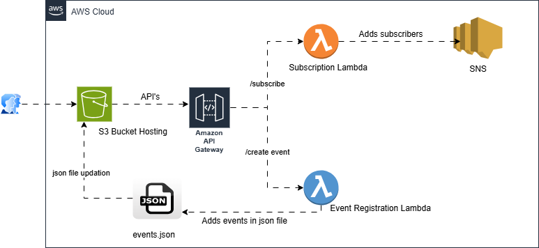

# 📢 Event Announcement Website (AWS Serverless Project)

## ☁️ Project Overview

This project is a fully serverless event announcement web application built using AWS services. It allows users to:

- ✅ View a list of upcoming events
- 📝 Submit new events using a web form
- 📧 Subscribe to receive event notifications via email

The frontend is hosted using Amazon S3 as a static website. AWS Lambda handles the backend logic for adding subscribers and creating new events. Email notifications are sent via Amazon SNS, and API Gateway acts as the bridge between the frontend and backend.

---

## 🛠️ AWS Services Used

| Service              | Purpose                                                                 |
|----------------------|-------------------------------------------------------------------------|
| Amazon S3            | Host the static website (HTML, CSS, and `events.json`)                  |
| AWS Lambda           | Handle business logic for event creation and user subscriptions         |
| Amazon SNS           | Manage email subscriptions and send event notifications                 |
| Amazon API Gateway   | Provide secure HTTP endpoints for frontend to interact with backend     |
| IAM Roles & Policies | Control secure access to AWS services used by Lambda                    |

---

## 📐 Architecture Diagram

---

## 💻 Features & Functionality

### 🔸 1. Static Frontend (Hosted on S3)
- `index.html`: Event list + form for adding new events & subscribing
- `styles.css`: Styling for the site
- `events.json`: JSON file that holds all event data

### 🔸 2. Create Event API
- Lambda function triggered via API Gateway (`/create-event`)
- Adds new event to `events.json` in S3
- Publishes event announcement to SNS topic

### 🔸 3. Subscribe API
- Lambda function triggered via API Gateway (`/subscribe`)
- Subscribes a new user email to the SNS topic

---

## 🗂️ Project Structure

